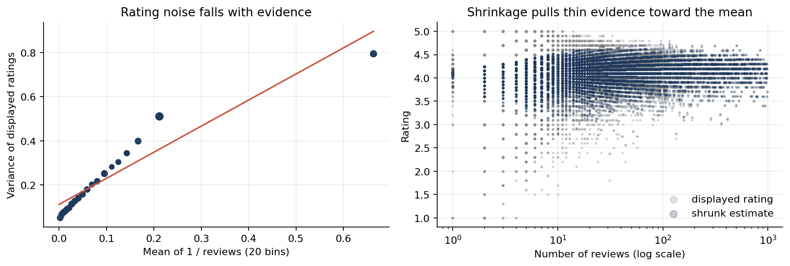

# Myntra Catalogue: Is Discounting Hiding Bad Products?

**Version 1 clustered 117,565 Myntra listings and found a "Risky" segment of 18,319 products rated 3.26 stars despite ~56% discounts, read as discounting masking a quality problem. Version 2 tests that story and finds it does not hold: the segment is a ratings cut-off resting on thin evidence, and discount depth says almost nothing about quality.**

**At a glance**

| | |
|---|---|
| **Question** | Is heavy discounting hiding bad products in a fashion catalogue? |
| **Data** | 526,564 Myntra listings |
| **Result** | The "Risky" segment is a rating cut-off: a rule on rating alone (3.65 stars or below) matches it for 96% of products, and only 531 of 18,319 "Risky" products are reliably below 3.5 stars |
| **Stack** | Python, scikit-learn, statsmodels, empirical Bayes |

Data: a scrape of 526,564 Myntra listings (brand, category, gender, original and discounted price, average rating, review count), published on Kaggle. `scripts/get_data.py` fetches a public copy; v1's clusters reproduce exactly from it.

**Notebook:** [`notebooks/catalogue_quality.ipynb`](notebooks/catalogue_quality.ipynb), step by step, every number printed by a cell.

## What v2 found

- **v1's sample could not test its own conclusion.** Only 36.2% of listings are rated, and v1's cleaning also dropped the 72,847 rated products sold at **full price**. Every product it analysed was discounted, so "discounting masks quality" had nothing to be compared against.
- **The four clusters are cuts of a continuum.** Silhouette is 0.30 or lower at every K from 2 to 8 (well-separated groups score above about 0.5), even though the cuts are stable across bootstrap samples (adjusted Rand index 0.99). A tree that looks only at the rating reproduces "Risky" membership for 96.4% of products: **the segment is "rated below about 3.7"**.
- **Those ratings rest on very little evidence.** The variance of displayed ratings follows `tau^2 + sigma^2 / n` almost exactly (R² 0.89). Individual reviews disagree by about 1.09 stars, while products' true quality varies by only 0.34, so a product needs about 10 reviews before its own average outweighs the catalogue's. Half the "Risky" products have 10 reviews or fewer. After empirical-Bayes shrinkage, the segment averages 3.72 stars, not 3.26, and **only 531 of its 18,319 products (2.9%) are reliably below 3.5 stars** (probability 0.9 or more).
- **Discount depth barely relates to quality.** Comparing products of the same brand and category, full-price items included, 10 more points of discount go with **0.008 fewer stars** (95% interval 0.005 to 0.011). Reliably poor products make up 1.0% of listings discounted over 70% and 0.4% of full-price ones. Several of the brands with the most reliably poor products sell at full price.



## What to do instead

Not "review or delist 18,319 products", but **review the 911 listings (0.5% of the rated catalogue) whose true rating is reliably below 3.5 stars**, and let new products collect reviews before judging them. Brand-level shares are in `results/brand_quality.csv`. No brand with 20 or more rated products has even a fifth of its range reliably poor.

| v1 | v2 |
|---|---|
| 117,565 products | Rated and discounted only; 72,847 full-price products dropped |
| Four segments (elbow) | Silhouette ≤ 0.30 at every K: a continuum |
| "Risky": 18,319 products at 3.26 stars | A rating cut-off; 531 reliably below 3.5 stars |
| Discounting masks quality | 0.008 stars per 10 points of discount, within brand and category |

## Reproduce

```bash
python -m venv .venv && .venv/bin/pip install -r requirements.txt
.venv/bin/python scripts/get_data.py
cd notebooks && ../.venv/bin/jupyter nbconvert --to notebook --execute --inplace catalogue_quality.ipynb
```

The notebook is paired with `notebooks/catalogue_quality.py` (jupytext); numbers are in `results/metrics.json`. v1's notebook (`main.ipynb`) is kept unchanged.

## Limits

A scrape of unknown date and terms, so only aggregates are published. Ratings arrive as averages without their distribution, so the normal model of review noise is an approximation. Review counts are capped at 999 (4 products). Reviews are not sales.
